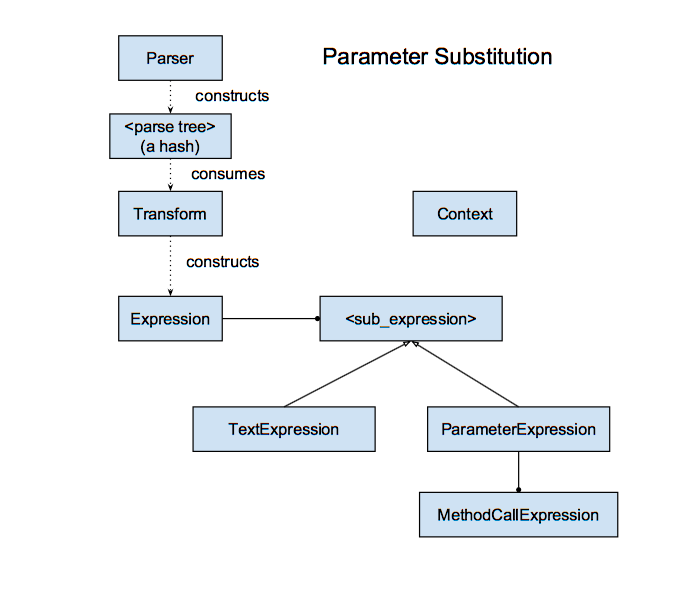

# ParameterSubstitution

Handles parsing an input string with embedded substitution parameters and replacing them with values from a provided mapping.  
The substitution can be formatted using a syntax that looks like method calls.  For example, the following will return `"it is a WINDY day"`.

```ruby
ParameterSubstitution.evaluate( input: "it is a <weather.upper> day", mapping: { "weather" => "windy" } )
```

## Installation

Add this line to your application's Gemfile:
```ruby
gem 'parameter_substitution'
```

And then execute:
```
$ bundle
```

Or install it yourself as:
```
$ gem install parameter_substitution
```


## Configuration

`ParameterSubstitution` is configured by supplying a `method_call_base_class`:
```ruby
ParameterSubstitution.configure do |config|
  config.method_call_base_class = FormatterBaseClass
end
```

So, in the `"it is a WINDY day"` example at the beginning of this README, the call to `upper` formats the input by calling the `format` method of the designated subclass of the `method_call_base_class`.
In this case it would be `FormatterBaseClass::Upper`.
```ruby
class Upper < FormatterBaseClass
  def self.description
    "Converts to string and returns all characters uppercased, preserves nil"
  end

  def self.format(value)
    value && value.to_s.upcase
  end
end
```

See `spec/spec_helper.rb` and `spec/helpers/` for more examples.


## Usage
Formats can take arguments and can be chained.  For example, the following formats the time using strftime to find just am or pm, and then compares that to say morning or evening.

```ruby
ParameterSubstitution.evaluate(
  input:   "good <time.date_time_strftime("%p").compare_string("am", "morning", "evening")>",
  mapping: { "time" => Time.now.to_s }
)
```

The substitution behavior is very configurable because it is used in many different environments.  The configuration is passed through named arguments to the evaluate method.  These named arguments have defaults that should work for most conditions.


## Design

[Design Drawing](https://docs.google.com/drawings/d/1A1nQVw_oh0dfN52pHNX19NtuEB5RY7RpM6Fv9bToGV4/edit)



The **ParameterSubstitution** module exposes the public interface for this subsystem.  All other classes are internal and should be considered private.

When evaluate is called, the module constructs a **Parser** to parse the input into a syntax tree.  Parser is implemented using the 
[Parslet](http://kschiess.github.io/parslet/) gem, which is pretty great.   The output from the parser is a ruby hash that describes the input.

The module then constructs a **Transform** to convert this syntax tree to an **Expression** that can be evaluated.  
An Expression has a list of sub expressions that are either **TextExpressions**, which simply returns the text when evaluated, or **SubstitutionExpressions** which return the formatted value from the mapping when called.  

SubstitutionExpressions have a list of **MethodCallExpressions**.   These expressions call the corresponding class in 'app/models/reporting/column_formats'  

**Context** is a helper class that is used to pass around the set of options for the current parameter substitution.  

## Next Steps

If you are working in this subsystem, consider the following improvements while you work:

 * The performance is pretty slow.  I believe the performance is suffering because it is building a parser for every request. Parsers take a couple input parameters, but really there are just a couple permutations.  (What type of open and close characters, are unbalanced closes allowed.)  We could have a parser factory that kept the parsers that were constructed for each permutation.
 * The error handling for missing methods could be better.  We raise the first error instead of all of the errors, and we could provide the location for each validation failure.
 * It would be nice if the column format methods provided a validation for their arguments.
 * The behavior for TokenReplacement.substitute_params is very odd.  Missing substitution parameters and nil subsitution parameters are handled differently for keys vs values and if the subtitution is the full string or part of the string.  I don't think this behavior is desired by customers and a more consistent handling would make for much cleaner code.  (See any code that is handling the :raw destination format)

## Running tests...

```
bundle exec rake test
```

## Development

After checking out the repo, run `bin/setup` to install dependencies. Then, run `rake spec` to run the tests. You can also run `bin/console` for an interactive prompt that will allow you to experiment.

To install this gem onto your local machine, run `bundle exec rake install`. To release a new version, update the version number in `version.rb`, and then run `bundle exec rake release`, which will create a git tag for the version, push git commits and tags, and push the `.gem` file to [rubygems.org](https://rubygems.org).

## Contributing

Bug reports and pull requests are welcome on GitHub at https://github.com/[USERNAME]/parameter_substitution.
